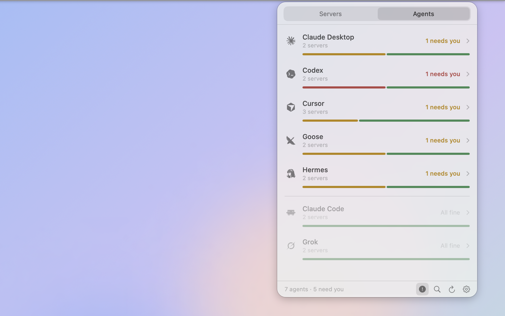

# mcpock

[](#install)
[](#for-developers)
[-6b8e6b)](docs/THIRD-PARTY.md)
[](docs/RELEASE-NOTES-v1.9.1.md)
[](LICENSE)

**A small Mac menu bar app that checks every MCP server your AI agents use, and
tells you which ones are broken, slow, waiting for a sign-in, or set up
differently from one agent to the next.**

MCP (Model Context Protocol) servers are the small programs that give agents
like Claude Code, Cursor or Codex their extra tools. mcpock finds them in your
agents' config files, starts each one the way the agent would, and checks that
it answers.


## Why

When you use more than one agent, the same MCP server ends up in five config
files, each written a little differently. One day a tool quietly stops working
in one agent and not the others, and you only notice when a task fails halfway.
The agent rarely says why.

mcpock gives you one place to look. It never changes your configs: it reads
them, checks every server, and shows you what needs attention and why, so you
(or your agent) can fix it.

## What it does

- **Finds your servers automatically.** It knows the config files of the common
  agents and also scans the usual config folders for anything written in a
  standard MCP format. The same server in several agents shows as one row.
- **Checks each one.** It starts a local server (or calls a remote one), does
  the MCP handshake, asks for its tool list, then closes it. Every 1 minute to
  4 hours, or only when you click Refresh.
- **Shows health as a shape, not only a colour:**

  | Shape | Means |
  |-------|-------|
  | Filled dot (green) | Fine: it started and listed its tools |
  | Ring (amber) | Slow (no answer in 10 s) or needs sign-in (HTTP 401/403) |
  | Ring (grey) | Still checking |
  | Diamond (red) | Broken: could not start, quit on start, or refused the handshake |
  | Dash (grey) | Paused by you, or runs inside its own app and can't be checked from outside |

- **Spots servers set up differently.** When one agent launches a different
  command or address than the others (often an old path), the row says so, and
  **Compare** shows each agent's version side by side. The same runtime in
  another folder (`npx` here, an agent's own `~/.agent/node/bin/npx` there) is not a
  difference. If the agents are
  meant to differ, choose **Mark as intended** on the card (or **Mark as
  Intended** in the right-click menu).
- **Problems first.** The list starts with *Needs you*, then your pinned
  servers, then everything else. One toggle in the footer shows only problems.
- **Agents tab.** The panel opens here: one row per agent with a small health
  bar that grows in after each check. Open an agent to see its servers (the
  first 5, **+N more** for the rest; servers that need you always show) and
  its config file. With the problems toggle on, agents with nothing wrong
  stay listed below, faded.
- **Usage counts.** Next to each server under an agent: how many times that
  agent called it in the last 7 days, 30 days or all time (Settings >
  General > Usage, or Off). Read from the agent's own history on your Mac:
  Claude Code, Grok, Cursor and Hermes today. A dash means that agent keeps
  no record mcpock can read yet.
- **Detail card.** Click a row: the full error (with **Ask an agent** and
  **Copy errors**), which agents use the server and where their config lives,
  its tools (name and short description; **+N more** lists them all), and
  **Check again**, **Pin** and **Hide**. While a server is re-checked, its
  row shows a small spinning mark.
- **Quiet menu bar icon.** Plain when all is fine, a small ring when something
  is slow or needs a look, a small diamond when something is broken. No
  numbers, no blinking, no notifications.
- **Keyboard friendly.** Arrow keys move, Return opens the card, Escape closes,
  Cmd-F searches servers, agents and tool names, Cmd-C copies the selected
  row's error (or its details).
- **Desktop widgets.** Status (small), Problems and Agents (medium): right-click
  the desktop, **Edit Widgets…**, search mcpock. They update after each check.
- **Glass theme.** Apple's Liquid Glass for the panel, the card and Settings,
  following light/dark and your Clear/Tinted setting. On macOS 27 the panel is
  its own see-through window, so the glass shows your real desktop.
- **Settings:** appearance (System, Dark, Light, Glass), how often to check, Open at
  Login, pin / show / hide each server, the list of agents found, export of all
  errors (Markdown or JSON), and **Connect** for your agents.
- **Lets your agents ask it.** A small read-only MCP server ships inside the
  app, so you can say "check my mcpock" to an agent instead of pasting errors.



## Install

1. Download `mcpock.dmg` from the [Releases](https://github.com/aka-kika/mcpock/releases) page.
2. Open it and drag **mcpock** to Applications. The app is signed and notarized
   by Apple, so it opens without warnings.
3. Launch it. mcpock lives only in the menu bar (look for the server-rack icon);
   there is no Dock icon and no window.

Needs **macOS 26 or later** on Apple Silicon.

**First launch, good to know:**

- mcpock starts checking the first time you click its icon. On a Mac with many
  agents the first list takes about 10 seconds.
- If one of your servers lives in **Documents, Desktop or Downloads**, macOS
  asks whether mcpock may open that folder. Click **Allow**: mcpock has to start
  the server from there to check it. If you clicked Don't Allow, turn it on in
  System Settings > Privacy & Security > Files and Folders (or Full Disk Access).
- Turn on **Open at Login** in Settings > General if you want it always there.

## Quick start

1. Click the menu bar icon. The **Servers** tab lists every server, problems first.
2. Click a row that needs you. The card says why, in plain words.
3. Click **Copy errors** (or **Ask an agent**) and paste it to your agent, or
   fix the config yourself.
4. Click **Check again** on the card (or **Refresh** in the footer) to confirm.
5. Right-click any server for Pause, Pin, Hide, **Copy Details**,
   **Copy Errors** and **Ask an Agent** (a prompt that asks an agent to look into
   the problem and advise you before it changes anything). Pause a server
   that opens a login page or an app each time it starts.

## Connect your agents

mcpock includes `mcpock-mcp`, a small MCP server your agents can call. It only
reads the status file mcpock writes after each check
(`~/Library/Application Support/mcpock/status.json`); it never starts a server
and never changes anything.

**The easy way:** Settings > **Connect** > **Copy for Claude**, then paste into
Claude Code. The prompt walks Claude through finding your agent configs,
backing each one up, adding `mcpock` where it's missing (in each file's own
format) and testing it.

**By hand:** Settings > Connect has a copy button per agent with the right
snippet. For Claude Code:

```bash
claude mcp add --scope user mcpock -- /Applications/mcpock.app/Contents/Helpers/mcpock-mcp
```

For agents that use `mcpServers` JSON (Claude Desktop, Cursor, Windsurf, Cline
and most others):

```json
{
  "mcpServers": {
    "mcpock": {
      "command": "/Applications/mcpock.app/Contents/Helpers/mcpock-mcp",
      "args": []
    }
  }
}
```

Then ask your agent to "check my mcpock". The tools it gets:

| Tool | Answers |
|------|---------|
| `mcpock_status` | Counts: how many servers are fine, broken, slow, need a sign-in or are set up differently, and when mcpock last checked |
| `mcpock_problems` | Every server that needs attention, with the reason, the agents and the config files involved |
| `mcpock_server` | Everything about one server, by name |

All three are read-only. Secrets are masked (see below). If mcpock isn't
running, hasn't checked yet, or its results are old, the answer says so.

Try it from Terminal:

```bash
printf '%s\n' \
  '{"jsonrpc":"2.0","id":1,"method":"initialize","params":{"protocolVersion":"2025-06-18","capabilities":{},"clientInfo":{"name":"check","version":"1"}}}' \
  '{"jsonrpc":"2.0","id":2,"method":"tools/list"}' \
  | /Applications/mcpock.app/Contents/Helpers/mcpock-mcp
```

## Supported agents

mcpock reads these files directly. Anything else that writes one of the
standard formats (JSON `mcpServers`, `servers` or `mcp`; TOML
`[mcp_servers.*]`; YAML `extensions:` or `mcp_servers:`) in `~/.config`,
`~/Library/Application Support` or a hidden folder in your home folder is found
by the scan, with no code change.

| Agent | Config file | Format |
|-------|-------------|--------|
| Claude Code | `~/.claude.json` (global and per-project servers), and `.mcp.json` files the scan finds | JSON |
| Claude Desktop | `~/Library/Application Support/Claude/claude_desktop_config.json` | JSON |
| Cursor | `~/.cursor/mcp.json` | JSON |
| Windsurf | `~/.codeium/windsurf/mcp_config.json` | JSON |
| Cline | `~/Library/Application Support/Code/User/globalStorage/saoudrizwan.claude-dev/settings/cline_mcp_settings.json` | JSON |
| Continue | `~/.continue/config.json` | JSON |
| VS Code | `~/Library/Application Support/Code/User/mcp.json` (`servers`) | JSON |
| Codex | `~/.codex/config.toml` | TOML |
| Grok | `~/.grok/config.toml` | TOML |
| Goose | `~/.config/goose/config.yaml` (`extensions:`) | YAML |
| Hermes | `~/.hermes/config.yaml` (`mcp_servers:`) | YAML |
| Kimi Code | `~/.kimi-code/mcp.json` | JSON |
| MiniMax | `~/.minimax/mcp.json` | JSON |
| OpenCode | `~/.config/opencode/opencode.json` (`mcp`) | JSON |
| aka | Asked from aka's local helper (`127.0.0.1:6464`) while aka runs | API |

Notes: servers turned off with `enabled: false` are skipped. Servers marked
`"builtin": true` (they run inside their own app) are shown
but never started. **aka** keeps its servers in its own database, so mcpock
asks aka's local helper for the list and starts each server the way aka does;
because aka launches servers its own way, it never counts toward "set up
differently". Thirty agents have their real logo in the app; others show two
letters.

## Privacy and safety

- **Read-only.** mcpock never edits, moves or rewrites any config file.
  "Open Config…" asks first, with Cancel as the default.
- **What it runs.** To check a local server, mcpock starts the exact command
  from your config, with its arguments and environment, in its project folder
  when it has one: the same thing your agent runs. It does the handshake, asks
  for the tool list, then stops the process and all its child processes.
  Remote servers get the same few requests over HTTP. Paused servers are never
  started.
- **No secrets leave the app.** The status file for agents holds env and header
  **names**, never their values. API keys in command lines, URLs and error
  texts are masked.
- **Network stays narrow.** The only connections are to the remote MCP
  servers in your configs, to aka on your own Mac if you use it, and
  to mcpock.com to check for app updates (Settings > About). No
  accounts, no analytics, nothing else phones home.
- **Updates are signed, and you're asked before the first automatic check.**
  mcpock checks mcpock.com for a newer version (Sparkle, its one dependency —
  see [docs/THIRD-PARTY.md](docs/THIRD-PARTY.md)); every update is verified
  against a key only the maintainer holds before it installs. Turn automatic checks off
  any time in Settings > About; "Check for Updates…" there always works.
- **Usage counts read, never keep, your chats.** To count calls, mcpock reads
  the agents' own history files and databases (read-only) and keeps only the
  agent, the server name and the day, in `~/Library/Application
  Support/mcpock/usage.json`. Never a message, an argument or a result.
  Settings > General > Usage > Off stops the reading.
- **Where it looks.** Only known config paths and the usual config folders.
  The scan never looks inside Documents, Desktop or Downloads, and it skips
  symbolic links so it can't be led anywhere else.
- **Why no App Store.** The App Store sandbox would stop mcpock from starting
  servers and reading configs in your home folder, so it ships as a signed,
  notarized download instead.

## For developers

### Build and run

You need macOS 26+, Xcode 26+ and [XcodeGen](https://github.com/yonaskolb/XcodeGen)
(`brew install xcodegen`).

```bash
git clone https://github.com/aka-kika/mcpock.git
cd mcpock
xcodegen generate
xcodebuild -scheme mcpock -configuration Debug \
  -derivedDataPath build \
  -destination 'platform=macOS,arch=arm64' build
open build/Build/Products/Debug/mcpock.app
```

Debug builds sign with an Apple Development identity (team in `project.yml`),
which keeps macOS folder permissions across rebuilds. Without that certificate,
add `CODE_SIGN_IDENTITY=- CODE_SIGNING_REQUIRED=NO` to the `xcodebuild` line
(that is what CI does).

### Test

```bash
./scripts/ci.sh      # xcodegen generate + build + test, same as GitHub Actions
```

583 unit tests at v1.9.1, and the build keeps zero warnings. They cover the
probes against real child processes and a real local HTTP server, process
cleanup, every config format, discovery and the scan's safety rules, grouping,
"set up differently", secret masking, the status file and the helper's
answers, and the panel's wording and layout.

### How it works

- **Discovery:** `AgentRegistry` (known paths) plus `ConfigScanner` (a shallow,
  size-capped scan of the usual config folders) plus `AkaSource`. A file counts
  only when it has at least one server with a `command` or a `url`, which keeps
  unrelated JSON out. TOML and YAML are read by small built-in parsers.
- **Probing:** `HealthMonitor` probes every server in parallel off the main
  thread. stdio servers get newline-delimited JSON-RPC (`initialize`,
  `tools/list`) and are then stopped along with their child processes. HTTP
  servers get the same over streamable HTTP (session id replayed) or legacy SSE.
  Identical setups are probed once. A single timeout shows as slow, a second one
  or a hard failure as broken, and failing servers back off to hourly checks.
- **Grouping:** instances with the same name (case and separators ignored)
  become one row; the worst state wins, and a launch target that differs from
  the majority becomes a "set up differently" note.
- **UI:** a `MenuBarExtra` panel of fixed size, with the detail card and tools
  window as child panels beside it that never take focus.
- **Agents:** after each change the app writes `status.json` and `status.md`;
  the bundled `mcpock-mcp` (stdio, read-only) answers from that file.

The full module map, the flow of one refresh, and the rules that must not
regress are in [docs/ARCHITECTURE.md](docs/ARCHITECTURE.md).

### Project layout

```
mcpock/                 The app
  MCPockApp.swift       Entry point: the menu bar item and panel
  Models/               Server config, health, groups
  Services/             Discovery, probes, process runner, texts, status file
  Theme/                Colours, fonts, appearance
  Views/                Panel, rows, detail card, Agents tab, Settings
  Assets.xcassets/      App icon, agent logos, About links
mcpock-mcp/             The read-only MCP helper (main.swift)
Shared/                 Code compiled into both app and helper
mcpockTests/            Unit tests
project.yml             XcodeGen spec (source of truth for the Xcode project)
scripts/ci.sh           Local CI: generate, build, test
scripts/release.sh      Release build, Developer ID signing, notarized DMG
scripts/appcast.sh      Sparkle's signed update feed (appcast.xml) from a folder of release DMGs
docs/                   Architecture, release notes, third-party credits
```

### Adding an agent

If it writes a standard format into a scanned folder, it already works. Add a
row to `AgentRegistry.known` for a clean name or a path outside the scan; add a
`ConfigShape` and a parser for a new format; add a logo as an
`agent-<name>.imageset` plus a `logoNames` entry. Details in
[docs/ARCHITECTURE.md §7](docs/ARCHITECTURE.md#7-adding-an-agent).

### Release

`scripts/release.sh` builds Release, signs with a Developer ID identity and
hardened runtime, notarizes and staples the app and the DMG, and writes
`dist/mcpock.dmg`. One-time setup, storing an app-specific password in your
keychain:

```bash
xcrun notarytool store-credentials my-notary \
  --apple-id "you@example.com" --team-id <TEAMID> \
  --password "<app-specific password from appleid.apple.com>"
MCPOCK_NOTARY_PROFILE=my-notary MCPOCK_SIGN_IDENTITY=<identity hash> ./scripts/release.sh
```

Without those two variables the script uses the maintainer's own profile and
identity.

## FAQ and troubleshooting

**macOS asks for permission to open a folder.**
One of your servers runs from Documents, Desktop or Downloads, and mcpock has
to start it there. Allow it once; it sticks. mcpock's own scan never looks in
those folders.

**A server shows broken. What now?**
Click it. The card shows the real error: "command not found" (the program isn't
installed, or isn't on the PATH mcpock uses: it adds `/opt/homebrew/bin`,
`/usr/local/bin` and `~/.local/bin`; use a full path in the config if needed),
"quit on start" with the server's own error text (often a missing API key), or
no answer in 10 seconds. Copy the error, fix it in the agent's config, then
Check again.

**It says "Needs sign-in".**
The server answered with HTTP 401 or 403. Sign in through your agent, or add
the token header to the config. mcpock never signs in for you, so this state
doesn't turn red.

**What does "set up differently" mean?**
The same server name launches a different command, script or address in one
agent than in the others. Sometimes that's intended; often it is an old path.
**Compare** on the card shows each version (secret values hidden).

If it's intended (say each agent has its own key and its own small launcher
script), click **Mark as intended** in the card's yellow box, or right-click
the row and choose **Mark as Intended**. The row stops counting as a problem, but
mcpock keeps checking it and still shows real errors. mcpock remembers how the
agents were set up at that moment (a short fingerprint of each command or
address, never keys or env values), agent by agent. If an agent's setup
changes later, or a new agent sets it up another way, the note comes back on
its own for that agent; an agent you remove keeps the mark quiet. The card then shows a quiet "Marked as intended" line;
**Undo** there, or **Unmark as Intended** in the right-click menu, takes it
back.

**A login page or an app opens every time mcpock checks.**
Starting that server has a side effect. Right-click it and choose **Pause**:
mcpock won't start it again until you resume it.

**The grey dash?**
Either you paused the server, or it runs inside its own app (marked
`"builtin": true`) and can't be checked from outside. Neither
counts as a problem.

**I added a server and it doesn't show.**
Click **Refresh** in the footer: it looks for configs again and checks
everything. The timer only re-checks servers it already knows.

**My agent says mcpock isn't running or hasn't checked yet.**
Open the panel once: mcpock starts checking on the first click, and writes the
status file after that.

**Hidden servers?**
Still checked, just not listed. Change it in Settings > Servers.

## Thanks

mcpock's interface was shaped by studying these open-source Mac apps, found and
kept with [reshelf](https://github.com/aka-kika/reshelf)
([site](https://aka-kika.github.io/reshelf/)), the author's app for collecting
repos. Thank you to their authors:

- [RepoBar](https://github.com/steipete/RepoBar) by @steipete: dashboard rows, detail on demand, pinned and hidden in Preferences.
- [Skills Manager](https://github.com/yibie/skills-manager) by @yibie: the "which agent uses what" view and showing set-up-differently states.
- [mectrics](https://github.com/farukkamcici/mectrics) by @farukkamcici: a quiet menu bar icon that only speaks up when something's wrong.
- [cctop](https://github.com/st0012/cctop) by @st0012: sorted by what needs you, keyboard first.
- [AgentBar](https://github.com/michalstrnadel/AgentBar) by @michalstrnadel: real agent marks instead of text.
- [Hop](https://github.com/antonyshakirov/hop) by @antonyshakirov: tabs in a menu bar panel.
- [TokenMon](https://github.com/faulknerpearce/token_monitor) by @faulknerpearce: a section per agent with a small bar.

## Credits

In-app updates run on [Sparkle](https://sparkle-project.org)
(MIT), mcpock's one code dependency.

Agent logos come from [LobeHub Icons](https://github.com/lobehub/lobe-icons)
(MIT) and, for Zed, Warp, JetBrains and Raycast,
[Simple Icons](https://github.com/simple-icons/simple-icons) (CC0). They are
trademarks of their owners; mcpock is not affiliated with or endorsed by any of
them. Details and license texts: [docs/THIRD-PARTY.md](docs/THIRD-PARTY.md).

## Contributing

Issues and pull requests are welcome. See [CONTRIBUTING.md](CONTRIBUTING.md).

## License

MIT. See [LICENSE](LICENSE).

---

Made by Kika · [akakika.com](https://akakika.com) · [X @akakikaaa](https://x.com/akakikaaa) · [GitHub aka-kika](https://github.com/aka-kika)
